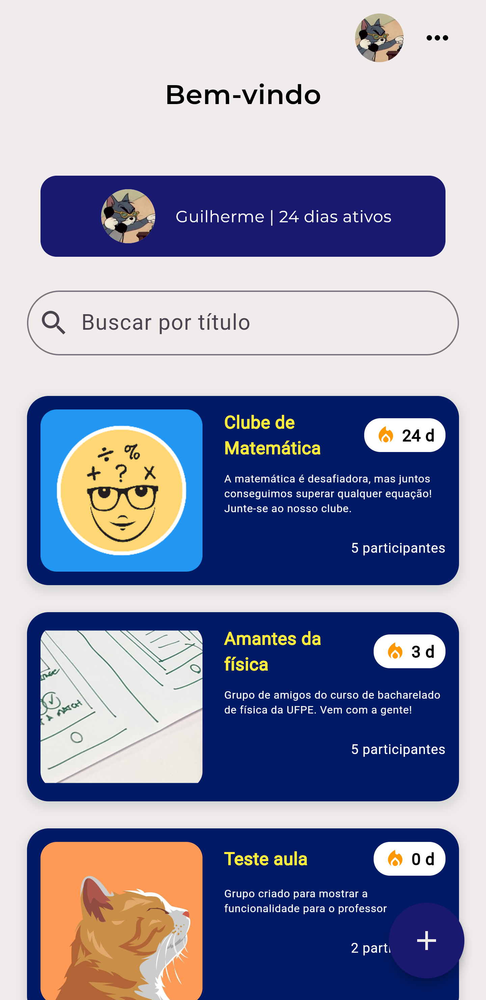
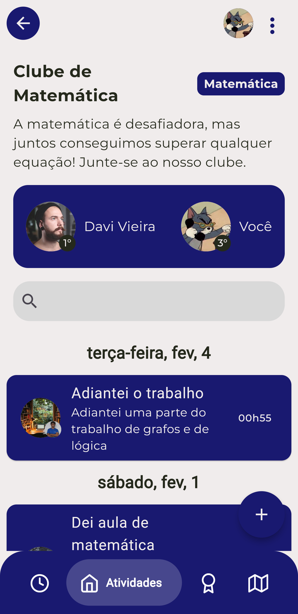
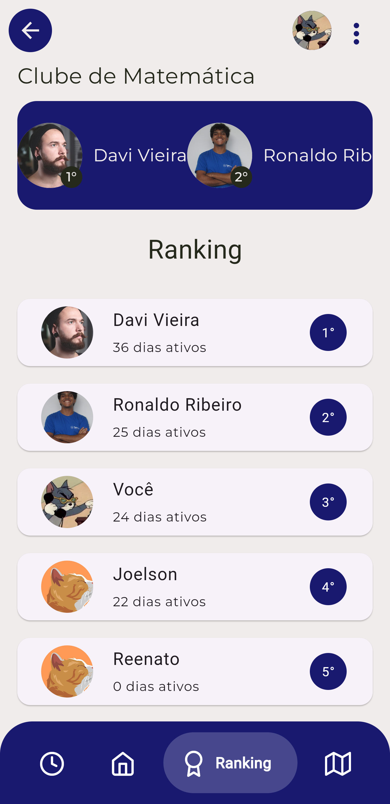
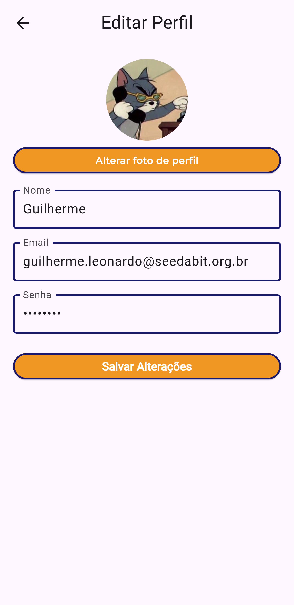

# DSI-2024.2

## 🎓 **Sobre o Projeto**
Este repositório foi desenvolvido como parte da disciplina de **Desenvolvimento para Sistemas de Informação** do **Bacharelado de Sistemas de Informação** na **Universidade Federal Rural de Pernambuco (UFRPE)**, no semestre **2024.2**.

O projeto consiste em um aplicativo mobile voltado para estudantes, que permite a criação e gestão de grupos temáticos, como grupos do curso de faculdade, cursinhos, amigos, ou outros interesses em comum. Dentro desses grupos, os participantes podem realizar atividades específicas para acumular pontos e competir em rankings internos.

### 👥 Equipe do Projeto
- Davi Vieira da Silva
- Guilherme Leonardo
- Ronaldo de Araújo

**Professor: Gabriel Alves**

---

## 📋 **Conteúdo do Repositório**
Este repositório contém os seguintes arquivos e diretórios principais:

- `lib/`: Código fonte do aplicativo Flutter.
- `assets/`: Arquivos de mídia e recursos utilizados no aplicativo.
- `pubspec.yaml`: Arquivo de configuração do Flutter com as dependências do projeto.

---

## 📄 **Artigo Científico**
Para mais detalhes sobre o projeto, consulte o [artigo científico](https://docs.google.com/document/d/1Wsb2ZdVZy8hvLGr82v3Cs0ESxvbr65g-y7KSkqC_o1w/edit?usp=sharing) que documenta as questões, objetivos, métodos e resultados obtidos.

---

## 📱 **Visão Geral do Aplicativo**

###  Visão Geral
O aplicativo é uma plataforma voltada para estudantes, que permite a criação e gestão de grupos temáticos. Dentro desses grupos, os participantes podem realizar atividades específicas para acumular pontos e competir em rankings internos. As atividades devem ser registradas com fotos e descrições detalhadas para que assim ganhem pontuações. Para incentivar a consistência, os usuários podem manter uma "streak" (sequência) ao enviar pelo menos uma atividade por dia no grupo.

### Objetivo
O principal objetivo do aplicativo é estimular o aprendizado e o compartilhamento de conhecimento entre os estudantes, utilizando a gamificação como ferramenta de engajamento. Além disso, busca-se incentivar os estudantes a manterem uma constância em seus estudos, ajudando-os a criar uma rotina mais estruturada e produtiva.

### Funcionalidades
- **Criação e Gestão de Grupos**: Permite a criação de grupos temáticos e a gestão dos mesmos.

- **Registro de Atividades**: Os usuários podem registrar atividades com fotos e descrições detalhadas.

- **Pontuação e Rankings**: Os participantes acumulam pontos e competem em rankings internos.
- **Streaks**: Incentiva a consistência ao permitir que os usuários mantenham uma sequência de atividades diárias.

- **Perfil do Usuário**: Exibição e edição das informações pessoais do usuário.

---
